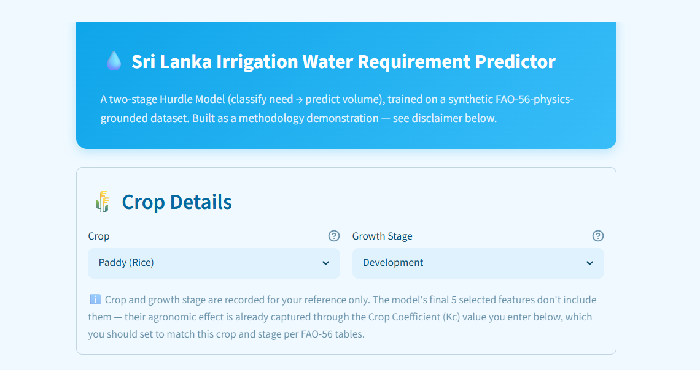
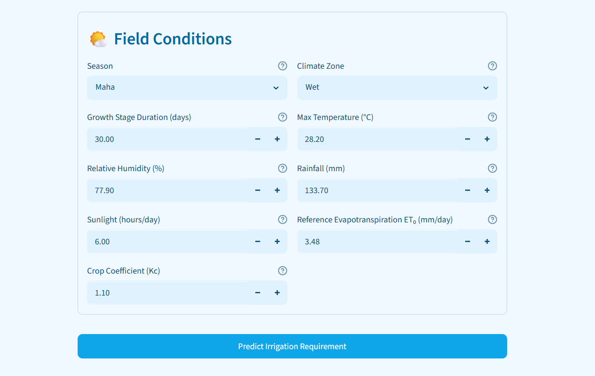
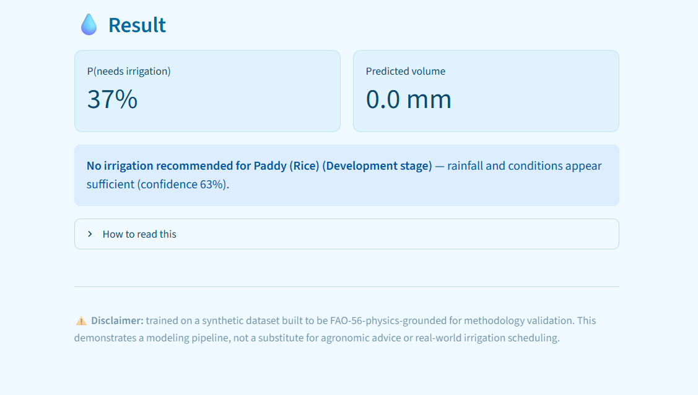

# 💧 Irrigation Water Requirement Prediction System

**A decision-support model that tells a farmer or irrigation scheduler two things: does this field need water right now, and if so, how much — built to reduce both crop stress from under-watering and waste from over-watering.**

[Live demo: Streamlit app](#running-the-app) · [Full technical workflow](Irrigation_Model_Complete_Workflow.md) · [Notebook](Final_Corrected_Irrigation_water_requirement_prediction.ipynb)

---

## The Problem

Irrigation decisions in Sri Lankan agriculture are typically made on fixed schedules or farmer intuition, not on the specific water balance of a given field at a given growth stage. Both failure modes are costly:

- **Under-irrigation** risks measurable crop stress and yield loss — the expensive mistake.
- **Over-irrigation** wastes water and, in pumped or metered systems, wastes money — the cheaper but still avoidable mistake.

The goal of this project is a model that supports that decision with a specific, defensible number for a specific field-stage — not a blanket recommendation, and not a black box.

## What Makes This a Decision-Support Tool, Not Just a Model

Most portfolio ML projects stop at "trained a model, got a good R²." This one is built around a different question: **would this survive being handed to someone who has to act on it?** That shaped every major decision below, and it's why the model is deployed as a working app, not just a notebook.

## Business Impact — In the Numbers That Actually Matter

| What we measured | Result | Why it matters operationally |
|---|---|---|
| Missed-irrigation events (crop stress risk) | **Cut by 37.5%** (48 → 30, out of 2,000 test cases) | This is the expensive failure mode — the model was deliberately tuned to reduce it |
| Cost of that reduction | **~1% increase in average prediction error** | A negligible accuracy trade for a meaningfully safer operating point |
| Accuracy in real drought conditions | **13.2%** relative error vs **18.0%** overall | The model is *more* reliable, not less, in the highest-stakes scenarios — verified on real held-out drought rows, not synthetic edge cases |
| Improvement over a pure agronomic formula (FAO-56, zero fitted parameters) | **37% lower error** | The ML layer earns its place over the textbook-standard approach already used in practice |

These numbers were chosen deliberately over a headline accuracy score, because a stakeholder doesn't act on R² — they act on "how often will this be wrong when it matters, and in which direction."

## How It Works

The target — irrigation water required per field per growth stage — is **zero-inflated**: 57% of cases need no water at all, with a long tail of increasing need on the rest. A single regression model handles this badly (it tends to blur the "clearly zero" and "clearly needs a lot" cases together). Instead, this is a **two-stage Hurdle Model**:

```
Field conditions  →  [Stage 1: Classifier]  →  needs water?
                              │
                             yes
                              ↓
                      [Stage 2: Regressor]  →  how much? (mm)
```

- **Stage 1** estimates the probability a field-stage needs any irrigation at all.
- **Stage 2**, trained only on cases that actually needed water, estimates the volume.
- The two stages are decoupled deliberately — Stage 1's probability is independently useful (e.g. a simple yes/no alert) even when Stage 2's volume estimate isn't needed.

## Key Design Decisions (and the reasoning behind each one)

A production mindset shows up in the decisions made *around* the model, not just the model itself:

- **Group-safe validation throughout.** Each field-growth-cycle contributes 4 rows (one per stage). All splitting and cross-validation is grouped by field-cycle, so no field's other growth stages leak between training and evaluation — a naive random split would have silently inflated every metric in this project.
- **Benchmarked against doing nothing fancy at all.** Before trusting the two-stage architecture, it was tested against (a) the plain FAO-56 physics formula with zero fitted parameters, and (b) a single-stage model with no hurdle. The hurdle model beats both, but only by a real, modest margin — that finding is reported honestly rather than dressed up, because overselling the architecture's benefit would be the first thing a technical reviewer catches.
- **The decision threshold is a business choice, not a model default.** The classifier's default cutoff (50%) was replaced with 40% after explicitly modeling the trade-off between missed-irrigation events and wasted-water false alarms — because in this domain, those two error types don't cost the same.
- **Stress-tested on real edge cases, not synthetic ones.** Model behavior under drought conditions was validated on actual held-out rows meeting drought criteria, not artificially constructed inputs — the latter can hide failure modes that only show up on real, correlated feature combinations.
- **Explainable by design.** SHAP values are generated for both stages so that a prediction can be justified feature-by-feature, not just trusted on faith — necessary for anything a real decision-maker is expected to act on.
- **Shipped, not just modeled.** All preprocessing objects, both models, and the inference logic are serialized with a single source of truth for categorical encoding, and deployed behind an actual interface (see below) — because a notebook that ends at `model.predict()` isn't a deliverable, it's a draft.

## Try It

A Streamlit interface takes 9 field-condition inputs and returns the irrigation recommendation, probability, and predicted volume in real time.

### Try It
A Streamlit interface takes 9 field-condition inputs and returns the irrigation recommendation, probability, and predicted volume in real time.

<p align="center">
  
  
  
</p>


### Running the app

```bash
pip install -r requirements.txt
streamlit run app.py
```

Place the `irrigation_model_artifacts/` folder (produced by the notebook's serialization step) and the `.streamlit/config.toml` theme file in the same directory as `app.py`.

## Project Structure

```
.
├── app.py                                              # Streamlit deployment
├── .streamlit/
│   └── config.toml                                     # App theme
├── irrigation_model_artifacts/                          # Serialized models & preprocessing objects
│   ├── stage1_classifier.joblib
│   ├── stage2_regressor.joblib
│   ├── stage1_scaler.joblib
│   ├── stage2_scaler.joblib
│   ├── onehot_encoder.joblib
│   └── metadata.json
├── Final_Corrected_Irrigation_water_requirement_prediction.ipynb   # Full modeling pipeline
├── sri_lanka_irrigation_dataset.csv                     # Training data
├── Irrigation_Model_Complete_Workflow.md                # Step-by-step technical documentation
├── requirements.txt
└── README.md
```

## Honest Limitations

- **The dataset is synthetic**, generated to be grounded in FAO-56 crop-water-balance physics specifically so the modeling pipeline could be validated against a known, defensible ground truth. It is a methodology demonstration, not a model trained on measured field sensor data — stated plainly here rather than left for someone else to discover.
- This is a **decision-support tool**, not a replacement for agronomic judgment or real-time soil moisture sensing. It's built to inform a decision, not automate one unsupervised.
- The current threshold (40%) reflects one reasonable assumption about the relative cost of under- vs over-irrigation. A deployment with different economics (e.g. very expensive water, or drought-restricted supply) should reassess that trade-off rather than inherit it by default.

## What This Project Demonstrates

An end-to-end applied ML workflow: correctly diagnosing a non-standard target distribution and choosing an architecture for it; group-safe validation discipline; honest benchmarking against simpler alternatives rather than assuming added complexity is automatically better; a deliberate, cost-aware operating point rather than a default one; explainability; edge-case stress testing on real data; and a deployed, working interface rather than a notebook that stops at a metric.

## Tech Stack

`Python` · `scikit-learn` (Random Forest, Gradient Boosting) · `pandas` / `NumPy` · `SHAP` · `Streamlit` · `joblib`

## Roadmap

- [ ] Validate against real field sensor / weather station data, not synthetic data
- [ ] Extend to additional crops and agro-climatic zones beyond the current coverage
- [ ] Integrate a live weather API so `Rainfall_mm` / `ET0` don't require manual entry
- [ ] Add per-field historical tracking so recommendations can incorporate recent irrigation history, not just the current stage snapshot

## Author

**Mubarak Muhammed Shabeeb**
GitHub: [@ShabeebMhd](https://github.com/ShabeebMhd)
